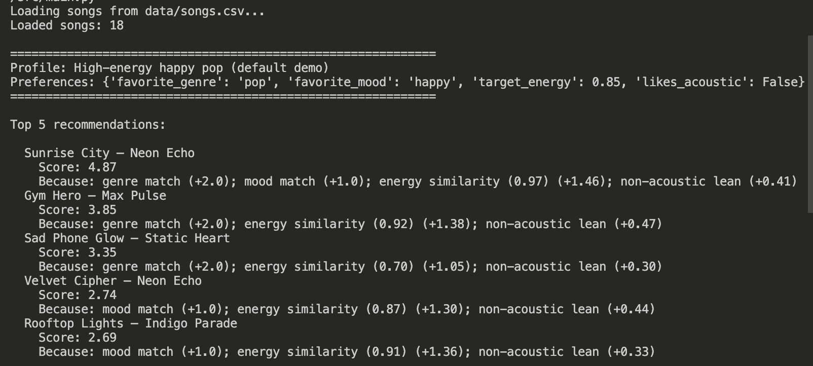
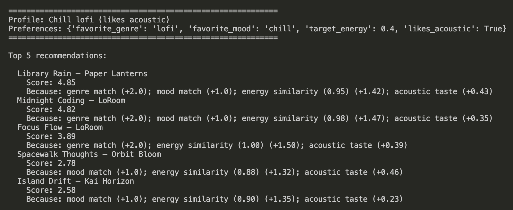
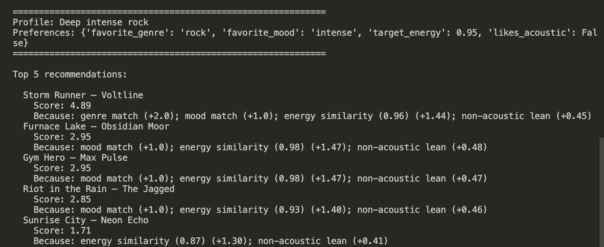
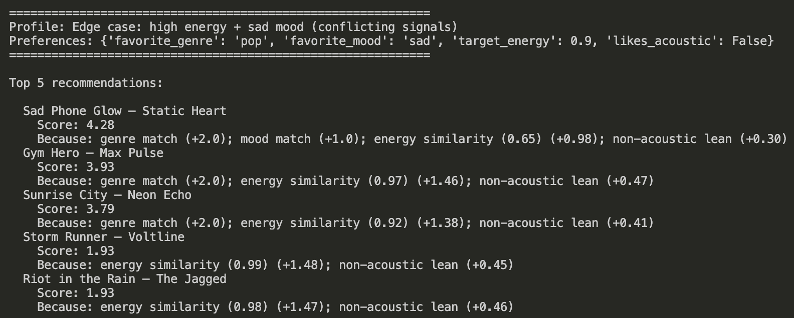

# 🎵 Music Recommender Simulation

## Project Summary

This repo simulates a **content-based** music recommender: each song in a CSV is scored against a small “taste profile” (favorite genre and mood, target energy, and whether the listener prefers acoustic textures). The highest-scoring tracks are ranked as the top recommendations. Explanations list which rules fired (genre match, mood match, energy similarity, acoustic preference), so the pipeline is easy to audit—unlike opaque production systems that blend collaborative and deep models.

The CLI (`python3 -m src.main`) loads the catalog, then runs several example profiles so you can compare outputs side by side.

---

## How The System Works

**Features per song (from `data/songs.csv`):** `id`, `title`, `artist`, `genre`, `mood`, `energy` (0–1), `tempo_bpm`, `valence`, `danceability`, and `acousticness`. Only **genre, mood, energy, acousticness** feed the score today; the other columns are available for future rules.

**User profile:** `favorite_genre`, `favorite_mood`, `target_energy`, and `likes_acoustic`. The functions also accept shorthand keys (`genre`, `mood`, `energy`) for quick experiments.

**Algorithm recipe (ranking rule):**

1. For **every** song, run `score_song` (the scoring rule for one track).
2. Sum weighted parts: **+2.0** if genre matches, **+1.0** if mood matches.
3. Add **energy similarity**: \(1 - |\"\"song_energy - target_energy|\"\) scaled by **1.5**.
4. Add **acoustic alignment**: if the user likes acoustic music, reward high `acousticness`; otherwise reward lower `acousticness` (weight **0.5**).
5. Sort all songs by total score (highest first), break ties by title, return the top **k**.

The object-oriented `Recommender` class uses the **same** `score_song` logic as the functional `recommend_songs` path, so tests and CLI stay in sync.

---

## Getting Started

### Setup

1. Create a virtual environment (optional but recommended):

   ```bash
   python -m venv .venv
   source .venv/bin/activate      # Mac or Linux
   .venv\Scripts\activate         # Windows

2. Install dependencies

   ```bash
   pip install -r requirements.txt
   ```

3. Run the app:

```bash
python -m src.main
```

### Running Tests

Run the starter tests with:

```bash
pytest
```

You can add more tests in `tests/test_recommender.py`.

---

## Experiments You Tried

- **Weight shift (energy vs genre):** In `src/recommender.py`, baseline weights are `WEIGHT_GENRE = 2.0` and `WEIGHT_ENERGY_SIMILARITY = 1.5`. Temporarily setting `WEIGHT_ENERGY_SIMILARITY` to **3.0** (and re-running `python3 -m src.main`) makes energy alignment matter more: high-energy tracks move up when genre and mood matches are tied or missing, which can **override** a weaker genre signal for ambiguous profiles.
- **Mood removed (mental / code experiment):** Commenting out the mood-match block in `score_song` would collapse “happy” vs “sad” pop tracks to the same genre tier, so **Gym Hero** and **Sunrise City** would separate mainly on energy and acoustic lean—illustrating how dropping a feature hides emotional nuance.

---

## Limitations and Risks

- Tiny, hand-made catalog; genres like `indie pop` do not exactly match `pop`, so some good fits get zero genre points.
- No collaborative filtering (no “users like you”), no audio or lyrics, no diversity penalty—so one artist or vibe can dominate the top k.
- Edge moods (e.g. `sad`) are rare; the model can fall back to **genre + energy**, which looks “accurate” but ignores sadness the user asked for.

See [model_card.md](model_card.md) for bias and evaluation detail.

---

## Reflection

Recommenders are mostly **transparent ranking**: features plus weights produce a score, and small weight changes swing who wins. Real apps add feedback loops (skips, repeats) that can amplify mainstream genres—similar to how our genre gate rewards exact string matches.

Pairwise profile comparisons and “what changed, why” notes live in [reflection.md](reflection.md). The full model documentation is in [**Model Card**](model_card.md).

### Terminal screenshots (course submission)









